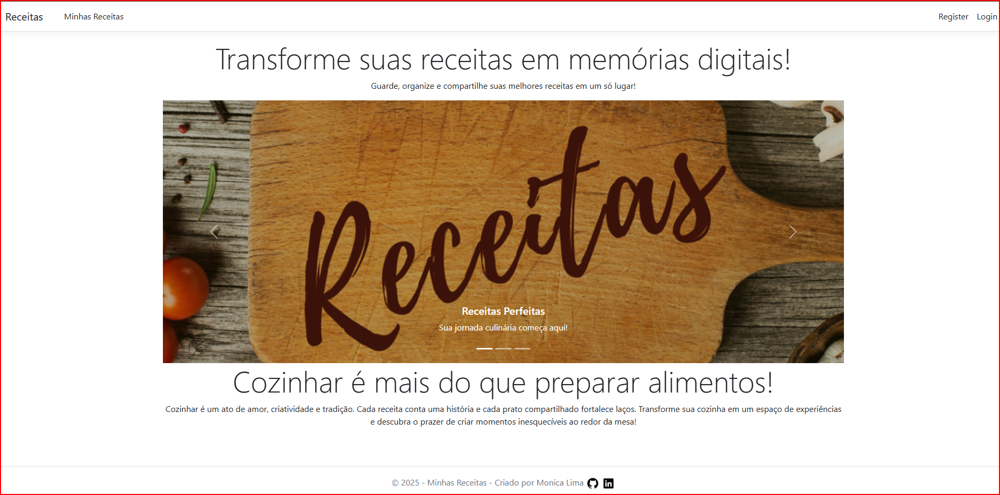
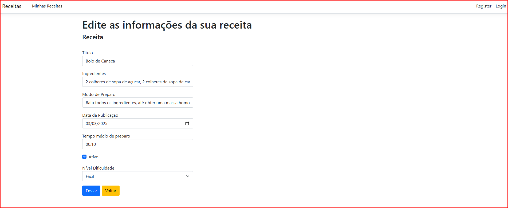
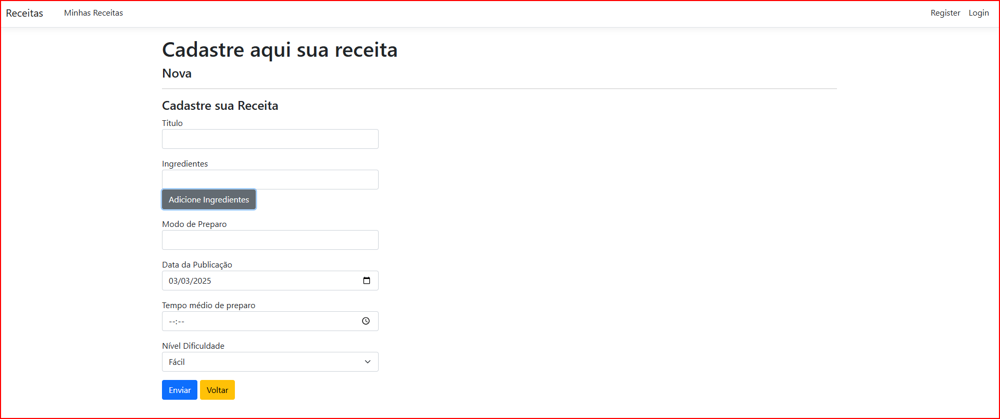
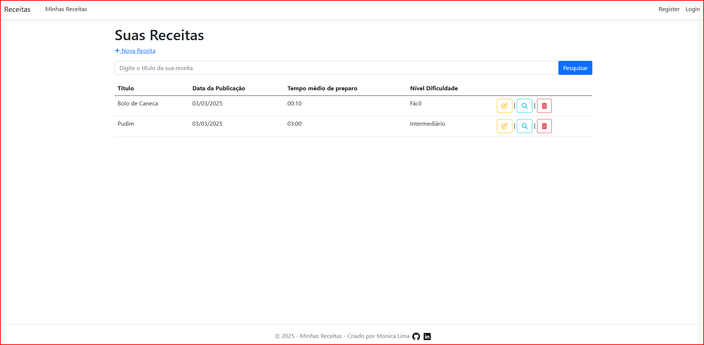

# Projeto 1 - Página Livro de Receita

## Funcionalidades
- **Cadastrar Receitas**
- **Editar receitas existentes**
- **Buscar por títulos**
- **Excluir receitas**
- **Listar todas as receitas ativas**
- **Habilitar Receitas Inativadas**

## Descrição do Projeto
Este projeto foi criado para fins de estudo onde estou buscando aprender sobre ASP.NET MVC.
Curso: Fundamentos do AspNet MVC

## Tecnologias Utilziadas
- **Bootstrap** para o design responsivo
- Banco de dados **LocalDB** para armazenamento das receitas

### Vídeo de Demonstração
   * :triangular_flag_on_post: Clique na imagem
    * 

## Imagens do Projeto

